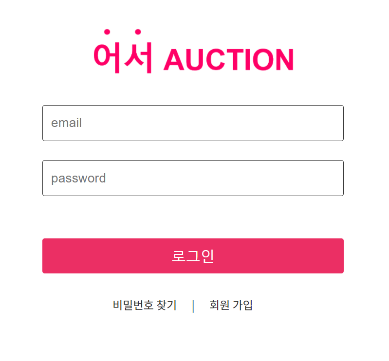
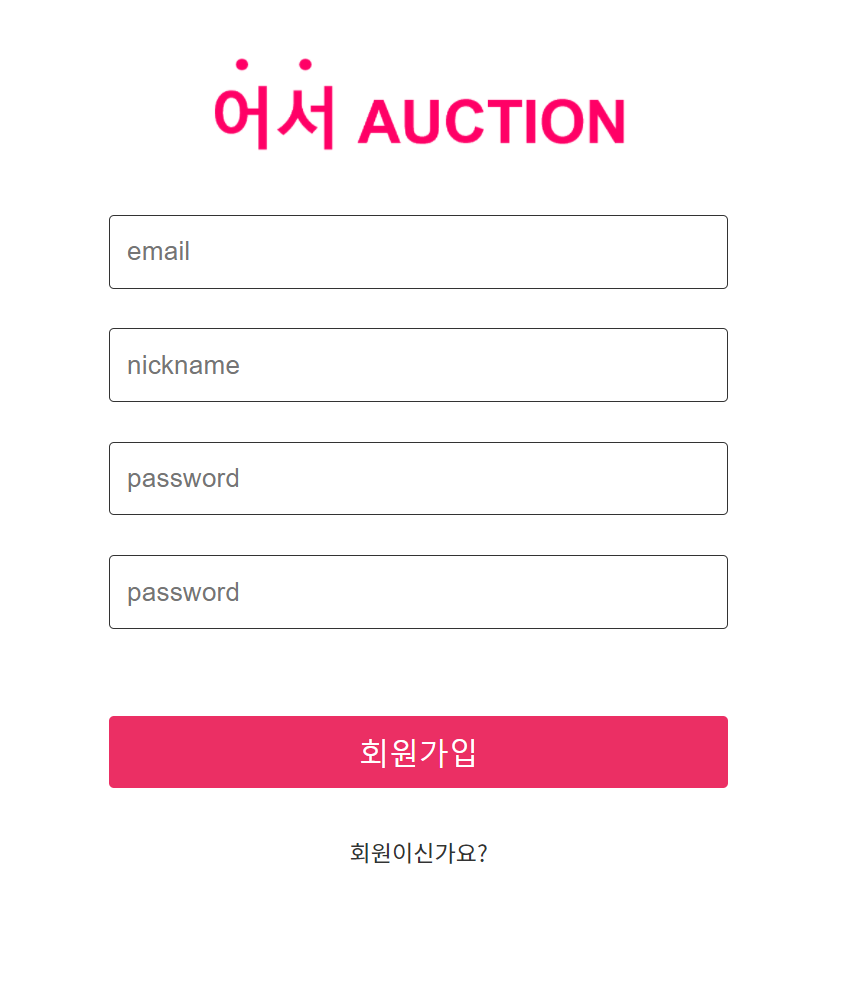
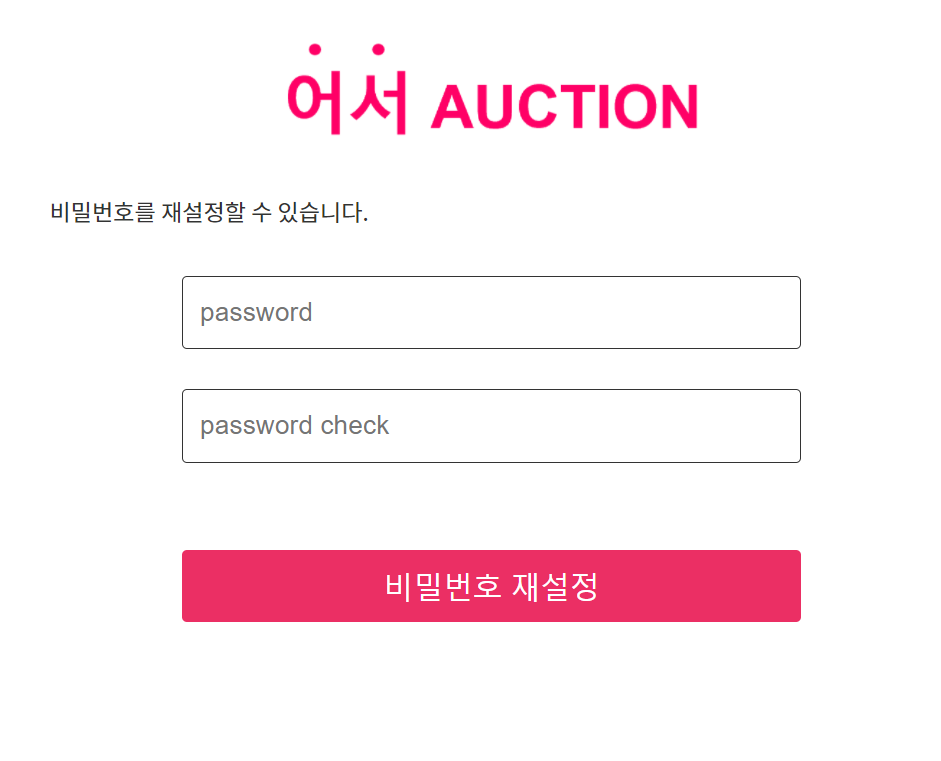
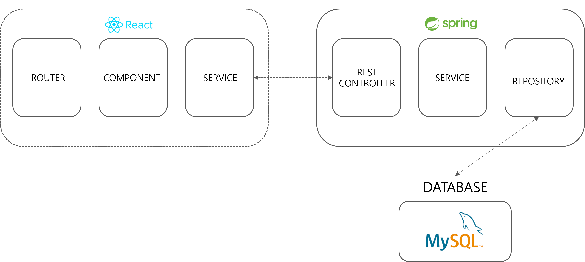
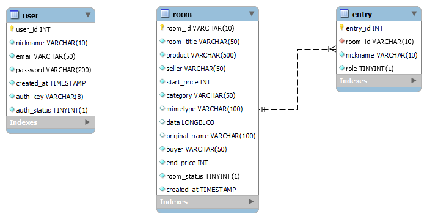

# 어서 Auction(경매를 통한 중고거래 플랫폼)


## 어서 Auction 소개 ##

- 어서 Auction은 중고거래 웹 프로젝트입니다. 핵심 기능은 다음과 같습니다.


## Overview

- 몇시간, 몇일 동안 거래 상대방과 가격 흥정하는 데 지치셨나요? 이젠 10분간의 경매를 통해 중고거래를 신속하게 끝내보세요!


## 어서 Auction 서비스 화면 ##

### 랜딩 페이지 ###


### 로그인 ###



### 회원가입(이메일 인증) ###



### 비밀번호 재설정 ###




### 홈 페이지 ###


### 경매실 생성 페이지 ###


### 경매실 내부 페이지 ###


### 마이 페이지 ###


## 주요 기능 ##

- 서비스 설명 : 경매를 통해 신속하게 끝내는 중고 거래 서비스
- 주요 기능 :
  - webRTC를 통한 실시간 화상 경매 서비스 (라이브 스트리밍, 실시간 채팅)
  - 실시간 소통을 통한 거래 물품 신뢰 제공
  - 속도감 있는 거래
  - 카테고리의 구분을 통해 상품을 모아 볼 수 있음


## 개발 환경 ##

### 💎 Frontend ###

- Visual Studio Code
- React.js
- React-bootstrap
- React-router-dom
- Axios
- styled-components
- JavaScript
- HTML 5
- MUI


### 👑 **Backend**  ###

- eclipse
- spring boot
- spring-boot-jpa
- Spring Security
- Java 8
- AWS EC2
- JWT


### 💡 DB : MySQL ###

- MySQL 8.0.28
- Redis 6.2.6


### 🌳 **운영체제, 서버** ###

- Ubuntu 20.04
- AWS EC2
- Jenkins
- Nginx
- Docker


### Web RTC ###

- openvidu


## 서비스 아키텍쳐 ##





## 협업 툴 ##

- Git
- Jira
- Notion
- Mattermost
- Webex


## GIT CONVENTIONS ##

- 커밋 룰
- 커밋 메세지의 구조는 다음과 같다. 각 항목 사이에는 1줄의 공백이 있다.

```
<subject>

<body>

<footer>
```

- Subject
  - [구조] <type>: <#issue_number> <jira_subtask_title>
  - 이슈넘버, 지라가 따로없으면 생략한다.
  - <type>

```
feat : 새로운 기능 추가
fix : 버그 수정
docs : 문서 수정
chore : 그 외 자잘한 작업
test : 테스트 코드
build : 시스템 또는 외부 종속성에 영향을 미치는 변경사항 (npm, gulp, yarn 레벨)
ci : CI관련 설정
style : 코드 의미에 영향을 주지 않는 변경사항 (포맷, 세미콜론 누락, 공백 등)
refactor : 성능 개선
remove: 파일 삭제만 했을 때
rename: 브래이름만 바꿨을때
```

- <description>은 동사 원형 형식으로 간결하게 작성한다.

```
feat: #S06P12D206-67 랜딩페이지 회원가입 로그인 버튼 추가했습니다. (x)
feat: #S06P12D206-67 랜딩페이지 회원가입 로그인 버튼 추가 (o)
```

- <decription>의 파일이름은 큰따옴표로 감싼다.

```
docs: "Readme.md" 제목 수정
```

- Body

  - <Body>에는 ‘무엇’을 ‘왜’ 했는지를 토대로 작성한다.
  - <Body>는 **생략할 수 없다.**
  - 평서문으로 작성한다.

- footer

  - [구조] <Label>: #<이슈넘버>
  - 생략 가능하다.
  - 해당 커밋과 연관있는 이슈를 트래킹한다.
  - label

  

```
- Body
    - <Body>에는 ‘무엇’을 ‘왜’ 했는지를 토대로 작성한다.
    - <Body>는 **생략할 수 없다.**
    - 평서문으로 작성한다.
    
- footer
    - [구조] <Label>: #<이슈넘버>
    - 생략 가능하다.
    - 해당 커밋과 연관있는 이슈를 트래킹한다.
    - label
```


## ER Diagram ##




## 카테고리

| Application | Domain | Language | Framework |
| ---- | ---- | ---- | ---- |
| :white_check_mark: Desktop Web | :white_check_mark: WebRTC | :white_check_mark: JavaScript | :black_square_button: Vue.js |
| :white_check_mark: Mobile Web | :black_square_button: Big Data | :black_square_button: TypeScript | :white_check_mark: React |
| :white_check_mark: Responsive Web | :black_square_button: Blockchain | :black_square_button: C/C++ | :black_square_button: Angular |
| :black_square_button: Android App | :black_square_button: IoT | :black_square_button: C# | :black_square_button: Node.js |
| :black_square_button: iOS App | :black_square_button: AR/VR/Metaverse | :black_square_button: Python | :black_square_button: Flask/Django |
| :black_square_button: Desktop App | :black_square_button: Game | :white_check_mark: Java | :white_check_mark: Spring/Springboot |
| | :black_square_button: AI | :black_square_button: Kotlin | |


## 밥은 먹고 다니나 팀을 소개합니다 ##

| 박창건   | 남근호   | 박기성  | 장세영 | 최현석   |
| -------- | -------- | ------- | ------ | -------- |
|          |          |         |        |          |
| Frontend | Frontend | Backend | Infra  | Frontend |

