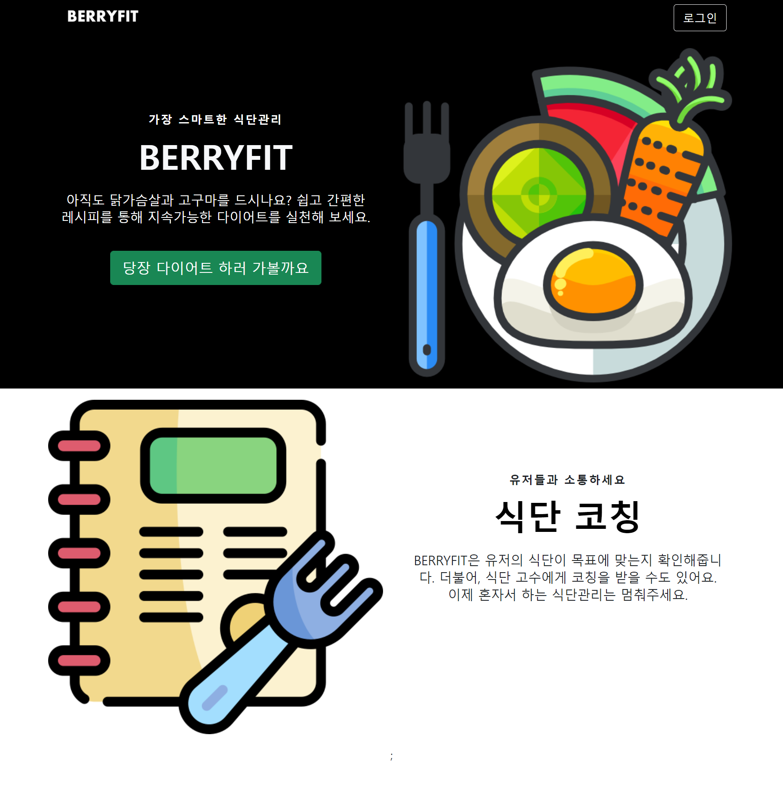
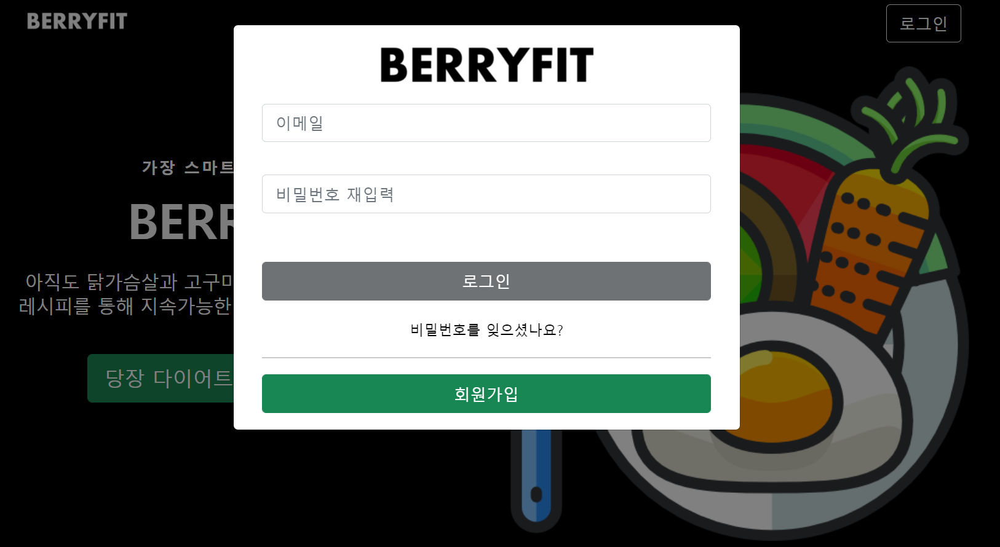
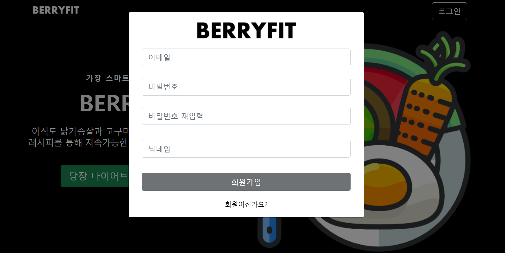

# BERRYFIT!!!

## BERRYFIT 소개 ##

​	BERRYFIT은 식단관리 웹 프로젝트입니다. 핵심 기능은 다음과 같습니다.

* 사용자는 여러가지 레시피를 참고하고, 자신의 식단으로 가져올 수 있습니다.
* 레시피는 입맛에 맞게 커스텀할 수 있으며, 영양성분또한 조절할 수 있습니다.
* 사용자가 구성한 식단을 사용자의 체중, 키, 나이, 활동지수를 고려하여 목표에 부합하는지 알려줍니다
* 다:른 사용자에게 조언을 구하고 코칭을 받을 수 있는 화상회의를 제공합니다.
* 우리는 'BERRY'라는 화폐를 사용합니다.
* 레시피를 기여하여 높은 조회수를 기록하거나 식단에 추가하는 사람이 많을때, 혹은 코칭을 했을 때 BERRY 수익이 발생합니다.
* 코칭을 받으려면 BERRY를 소모해야합니다.


## BERRYFIT 서비스 화면 ##

### 랜딩 페이지 ###



### 로그인 ###




### 회원가입(이메일 인증) ###



### 레시피 페이지 ###


## 주요 기능 ##

- 서비스 설명 : 식단을 만들어서 코칭을 받고 건강해지자
- 주요 기능 :
  - webRTC를 통한 실시간 화상 코칭 서비스
  - 레시피를 조회하여 건강한 먹거리 제공


## 개발 환경 ##

### Frontend ###

- Visual Studio Code
- React.js
- React-bootstrap
- React-router-dom
- Axios
- styled-components

### Backend ###

- eclipse
- spring boot
- spring-boot-jpa
- Spring Security
- Java 8
- AWS EC2
- mysql


### Web RTC ###

- openvidu


## 서비스 아키텍쳐 ##


## 협업 툴 ##

- Git
- Jira
- Notion
- Mattermost
- Webex


## GIT CONVENTIONS ##

- 커밋 룰
- 커밋 메세지의 구조는 다음과 같다. 각 항목 사이에는 1줄의 공백이 있다.

```
<subject>

<body>

<footer>
```

- Subject
  - [구조] <type>: <#issue_number> <jira_subtask_title>
  - 이슈넘버, 지라가 따로없으면 생략한다.
  - <type>

```
feat : 새로운 기능 추가
fix : 버그 수정
docs : 문서 수정
chore : 그 외 자잘한 작업
test : 테스트 코드
build : 시스템 또는 외부 종속성에 영향을 미치는 변경사항 (npm, gulp, yarn 레벨)
ci : CI관련 설정
style : 코드 의미에 영향을 주지 않는 변경사항 (포맷, 세미콜론 누락, 공백 등)
refactor : 성능 개선
remove: 파일 삭제만 했을 때
rename: 브래이름만 바꿨을때
```

- <description>은 동사 원형 형식으로 간결하게 작성한다.

```
feat: #S06P12D206-67 랜딩페이지 회원가입 로그인 버튼 추가했습니다. (x)
feat: #S06P12D206-67 랜딩페이지 회원가입 로그인 버튼 추가 (o)
```

- <decription>의 파일이름은 큰따옴표로 감싼다.

```
docs: "Readme.md" 제목 수정
```

- Body

  - <Body>에는 ‘무엇’을 ‘왜’ 했는지를 토대로 작성한다.
  - <Body>는 **생략할 수 없다.**
  - 평서문으로 작성한다.

- footer

  - [구조] <Label>: #<이슈넘버>
  - 생략 가능하다.
  - 해당 커밋과 연관있는 이슈를 트래킹한다.
  - label

  

```
- Body
    - <Body>에는 ‘무엇’을 ‘왜’ 했는지를 토대로 작성한다.
    - <Body>는 **생략할 수 없다.**
    - 평서문으로 작성한다.
    
- footer
    - [구조] <Label>: #<이슈넘버>
    - 생략 가능하다.
    - 해당 커밋과 연관있는 이슈를 트래킹한다.
    - label
```


## 카테고리

| Application | Domain | Language | Framework |
| ---- | ---- | ---- | ---- |
| :white_check_mark: Desktop Web | :white_check_mark: WebRTC | :white_check_mark: JavaScript | :black_square_button: Vue.js |
| :white_check_mark: Mobile Web | :black_square_button: Big Data | :black_square_button: TypeScript | :white_check_mark: React |
| :white_check_mark: Responsive Web | :black_square_button: Blockchain | :black_square_button: C/C++ | :black_square_button: Angular |
| :black_square_button: Android App | :black_square_button: IoT | :black_square_button: C# | :black_square_button: Node.js |
| :black_square_button: iOS App | :black_square_button: AR/VR/Metaverse | :black_square_button: Python | :black_square_button: Flask/Django |
| :black_square_button: Desktop App | :black_square_button: Game | :white_check_mark: Java | :white_check_mark: Spring/Springboot |
| | :black_square_button: AI | :black_square_button: Kotlin | |

